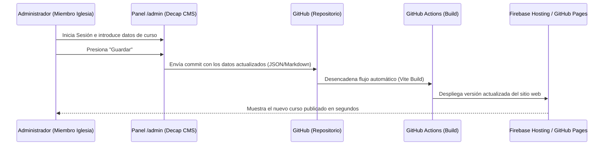

# Plan de Implementación de Decap CMS (GAP 1)
**Proyecto:** Sitio Web del Ministerio Educativo Cristiano  
**Fecha:** Junio 2026  

---

## 1. ¿Por qué Decap CMS?

Para resolver la limitación de la **gestión manual de contenidos**, proponemos **Decap CMS** (anteriormente Netlify CMS). Es un gestor de contenido basado en Git, lo que significa que **no requiere base de datos ni servidores activos**, manteniendo el costo de hospedaje en **$0.00 USD/mes**.

Los miembros autorizados de la iglesia podrán ingresar a `tudominio.com/admin/`, ver una interfaz visual intuitiva, crear o modificar cursos, y al hacer clic en "Guardar", los cambios se guardarán automáticamente en tu repositorio de GitHub, desencadenando la compilación automática de la web en producción.

---

## 2. Flujo de Trabajo y Arquitectura



---

## 3. Pasos para la Implementación Técnica

### Paso 1: Crear la Carpeta de Administración
Debemos crear una carpeta llamada `admin` dentro de `public/` (para que se copie directamente al compilar):
* Archivo 1: `public/admin/index.html` (Carga la interfaz del CMS)
* Archivo 2: `public/admin/config.yml` (Define los campos del formulario y el repositorio de Git)

### Paso 2: Contenido de `public/admin/index.html`
Este archivo simplemente arranca el script oficial de Decap CMS:
```html
<!DOCTYPE html>
<html>
<head>
  <meta charset="utf-8" />
  <meta name="viewport" content="width=device-width, initial-scale=1.0" />
  <title>Panel de Administración - Ministerio Educativo</title>
  <!-- Script de Decap CMS -->
  <script src="https://unpkg.com/decap-cms@^3.0.0/dist/decap-cms.js"></script>
</head>
<body>
</body>
</html>
```

### Paso 3: Configurar el Esquema en `public/admin/config.yml`
Aquí definimos a qué repositorio de GitHub conectarnos y qué campos tendrá el formulario de creación de cursos:

```yaml
backend:
  name: github
  repo: tu-usuario/InstitucionCristianaWeb # Ruta de tu repositorio en GitHub
  branch: main # Rama de producción
  
media_folder: "public/images/uploads" # Carpeta para guardar imágenes de los cursos
public_folder: "/images/uploads"

collections:
  - name: "cursos"
    label: "Cursos"
    folder: "src/content/cursos" # Carpeta donde se guardará cada curso como archivo Markdown/JSON
    create: true
    slug: "{{slug}}"
    fields:
      - { label: "Título del Curso", name: "title", widget: "string" }
      - { label: "Profesor", name: "teacher", widget: "string" }
      - { label: "Horario", name: "schedule", widget: "string" }
      - { label: "Duración (Semanas)", name: "duration", widget: "string" }
      - { label: "Modalidad", name: "modality", widget: "select", options: ["Presencial", "Virtual", "Híbrido"] }
      - { label: "Estado", name: "status", widget: "select", options: ["Inscripción Abierta", "En curso", "Cerrado", "Próximamente"] }
      - { label: "Enlace Google Forms", name: "enroll_link", widget: "string", required: false }
      - { label: "Descripción", name: "body", widget: "markdown" }
```

### Paso 4: Configurar la Autenticación (OAuth)
Para que los miembros de la iglesia puedan iniciar sesión de forma segura:
1. **GitHub OAuth App:** Registra una aplicación OAuth en tu cuenta de GitHub (en Developer Settings).
2. **Servidor Intermediario (Gatekeeper):** Para conectar Decap CMS con GitHub de manera segura y gratuita, se puede usar un servicio "Gatekeeper" serverless (se despliega con un clic en plataformas como Render o Vercel de forma gratuita) que gestiona el intercambio de tokens de sesión.

---

## 4. Dinamización de Cursos en el Frontend

Una vez implementado, en lugar de escribir los cursos a mano en `cursos.html`:
1. Los archivos se guardarán como archivos Markdown o JSON en `src/content/cursos/`.
2. Vite puede configurarse para leer estos archivos en tiempo de compilación y generar las tarjetas automáticamente, o podemos cargar un único archivo de consolidación mediante JS en la carga de la página.

---

## 5. Recomendación de Adopción

Dado que por ahora es un volumen bajo de cursos e instructores, **se recomienda iniciar editando directamente el código HTML** (ya estructurado de forma muy limpia y modular en `src/cursos.html`). 

A medida que el ministerio crezca y más miembros de la iglesia necesiten actualizar contenidos de forma independiente, se puede ejecutar este plan de Decap CMS en menos de un día para habilitarles el panel visual de administración `/admin` sin alterar los costos mensuales ($0.00 USD).
